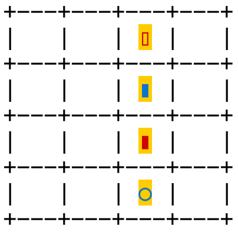

# Quadri 

Quadri is a two player board game similar to Connect 4. Instead of pieces having one attribute (red or black), they have 4.

## Getting Started

(Coming soon - compiled binaries for your architecture!)

1. (If needed) Setup rust on your machine using [rustup](https://rustup.rs/) (detailed instructions [here](https://rust-lang.github.io/rustup/installation/index.html)).
2. Clone the repo locally (forking if desired - contributions welcome).
3. In the local repo's root, run `cargo build --profile release`
4. In a full color terminal run `./target/release/quadri`
   1. Use a terminal emulator like VS Code, iterm2, kitty, etc. Don't use mac's default terminal as it doesn't support full color and won't render piece background colors.
5. Have fun!

## Rules 

### Setup

Quadri has 16 pieces, each with one of two values for 4 total attributes. 

In the CLI version these attributes are:
- Red or Blue 
- Rectangle or Circle
- Hollow or Full
- Yellow background or White background

All the pieces are shown below:

The quadri board is a 4 x 4 grid which starts empty. 

### Objective

You win if you are the person to PLACE the final piece that generates a quadri. A quadri is four pieces in appropriate spots that share at least one attribute in common. (4 red pieces can form a quadri or 4 blue pieces, 4 rectangles, 4 yellow background...)

Quadris can occur on:

- Horizontals

    

- Verticals
    
    

- Diagonals
  
    
- Square Corners - including small, medium, and large squares

    
    
    

### Play 

1. Player 1 picks a piece for Player 2 to place.
2. Player 2 places that piece.
3. Player 2 then picks a piece for player 1 to place.
4. Player 1 places that piece. 
5. Repeat until someone places a piece which makes a quadri!

## Contributing

Pull requests welcome.

Gentle and tactful rust education is also welcome!

## Motivation

One freezing day in Montreal, my wife and I went to a [board game cafe](http://colonelmoutarde.ca/) and asked the game sommelier if we could play [Set](https://smart-games.org/en/set/) while we had some drinks and dinner. The game sommelier didn't know of set, but after our description he brought us [Quarto](https://boardgamegeek.com/boardgame/681/quarto), which I instantly loved. It appealed to my math loving side - I wanted to know if draws were possible, how frequently they were possible, and what isomorphisms existed due to board symmetry and mapping across pieces. For months- on and off- I thought about it (though I didn't actually "do" any math).

While on [FMLA Leave](https://en.wikipedia.org/wiki/Family_and_Medical_Leave_Act_of_1993) from work to care for a sick family member, I took my miniscule amount of free time to build my own version of Quarto. I wanted to practice rust (which I've been learning off an on), build a tool that I could use to answer some of my combinatorial questions (who wants to read textbooks, do real math, and use paper?!?), and provide something where I could "accomplish a project" while living in random hotels and hanging out in hospitals. 

Currently (2023/01), the game only supports a two-player local version. I'm hoping to first answers some of my math questions, then build a GUI using svelte and WASM (two other technologies that I'm interested in learning), then allow for more customizablity of games (what defines a "quadri"), then build an AI. In the unlikely event I actually do all of that, perhaps I'll support two player remote play or try to package it into a mobile app.

Mathematically, I'm also interested in the generalization of this style of game - can you make a different shaped board that fills completely with pieces using 5 attributes or 3 attributes? What about pairs of attributes? What about 3 dimensions?
